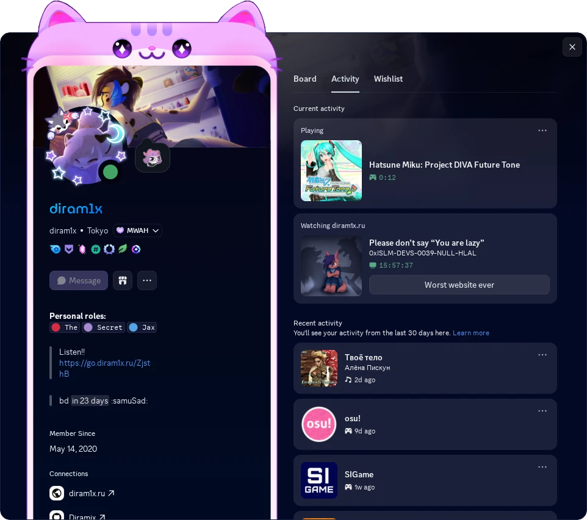
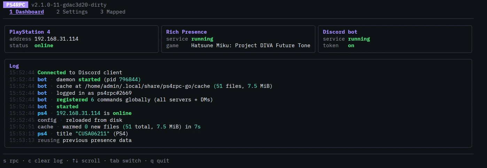

# PS4RPC Go

## Changes in this fork

- **Added a TUI for configuration**
- **Added a Discord bot**
- **Presence is cleared on the main menu**
- **Console with a configured IP that is offline is treated as sleeping**

## Discord Bot Setup

1. Create an application in the [Discord Developer Portal](https://discord.com/developers/applications), then copy the bot token.
2. In the application's **Installation** settings, enable **User Install** and select the `applications.commands` scope when generating the install link, so the bot's slash commands are available directly on your account.
3. Open the settings in the TUI and fill in the following fields:
   - `Token` - Bot token
   - `Owner UID` - Discord user ID of the bot owner
   - `PS4 Account ID` - Local PS4 account ID (If you have one more account)
4. Make sure PS4 IP is set.
5. Run the bot with `ps4rpc bot`, or from the TUI.

## Configuration location

The program stores its config files in a per-user data directory:

- **Windows:** `%LOCALAPPDATA%\ps4rpc-go`
- **Linux:** `~/.local/share/ps4rpc-go`

> Special thanks to [zorua98741](https://github.com/zorua98741/PS4-Rich-Presence-for-Discord) for the original project
